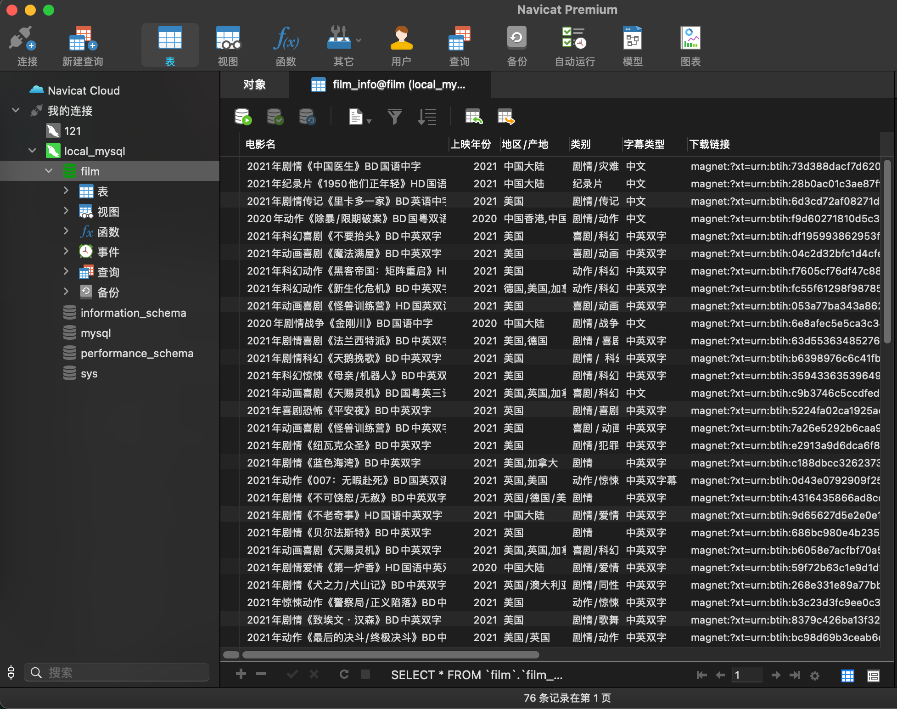

# Python爬虫 多线程爬取盗版天堂6000部电影

---




## 使用方式

>  首先安装包依赖：  
>  ```pip install -r requirements.txt```

### 方式一、mysql存储

需配置mysql环境。然后修改源代码中下列几处内容(填入的数据库需要预先手动创建)

```python
conn = pymysql.connect(host='xxxxx',		# 如果数据库在本地可填 localhost
                       user='xxxxx',		# 登录mysql的用户名
                       password='xxxxx',	# 密码
                       database='xxxxx')	# 数据库名
```

```
mysql> CREATE DATABASE xxxxx;
```

默认每次不会清空数据表内容。如需要取消下列两行注释

```python
# cursor.execute('''DROP TABLE film_info;''')       # 每次清空数据表
# conn.commit()
```

---

### 方式二、sqlite存储

sqlite对比mysql 更轻量、配置更友好。在源码基础上修改如下：

```python
conn = pymysql.connect(host='xxxxx',
                       user='xxxxx',
                       password='xxxxx',
                       database='xxxxx')
```

改成：

```python
conn = sqlite3.connect("xxx.db")	# 填写本地数据库文件。如不存在会自动创建
```

其他和方式一相同

---

## Notice:

- 运行过程中会有warning，不要慌，是关闭了https验证的缘故。
- 虽然是多线程，但为了防止被封ip全过程跑完大概仍需要接近20分钟
- 盗版天堂的资源会经常更新，可设置crontab定时器每个月爬一次


